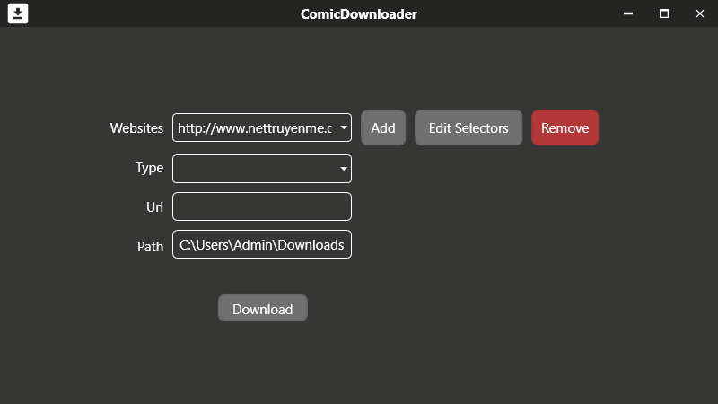

# ComicDownloader
### Require:
- WebView2
- .Net Core 3.1

### Features:
- Add css selectors of website to download 
- Edit css selectors of website 
- 3 downloading type to choose: Comics, comic, chapter 
- Get css selectors by mouse click with WebView2 (Selectors Setter)

## Images
#### Home

#### Add css selectors

#### Edit css selectors

#### Get css selectors by WebView2 (Selectors Setter)

